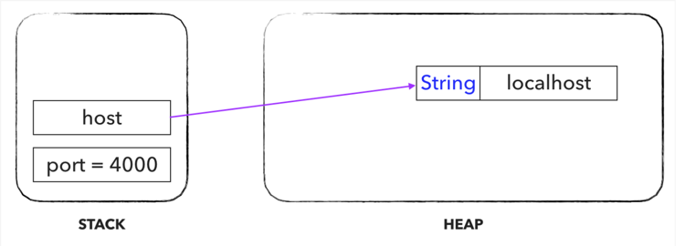
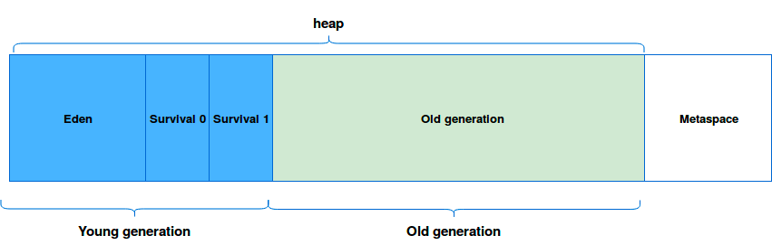
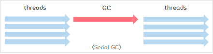
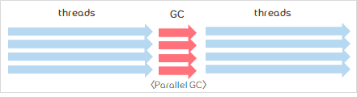
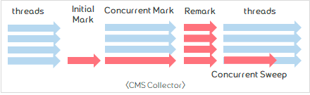
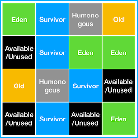

## 가비지 컬렉션 (Garbage Collection) 이란?
- **자바 애플리케이션의 메모리 사용을 관리해주는 프로그램**입니다.
- 어플리케이션을 실행하면서 변수, 함수 실행, 객체생성 등의 다양한 이유로 애플리케이션의 메모리 사용량은 커지게 됩니다. 특히 객체의 경우 더이상 참조하지 않게 되는(Unreachable) 상태가 발생하는데, 
  이러한 유효하지 않은 메모리 점유를 해제하지 않으면 어플리케이션 실행 시간이 길어짐에 따라 메모리를 과도하게 점유하여 프로세스가 멈추게 됩니다.
- C 계열의 언어의 경우 OS 레벨의 메모리에 직접 접근하기 때문에 해제를 위한 free() 라는 함수를 제공하지만, 자바는 개발자가 직접 메모리를 해제해주는 일이 없습니다. 
  그러한 작업은 모두 가바지 컬렉터가 진행하기 때문입니다.
- 자바 어플리케이션의 경우 JVM 을 통해 OS 메모리에 접근하는데, 이는 개발자가 메모리 관리를 신경 쓰지 않고 검증된 기능을 통해 대신 이용할 수 있도록 하는데 목적이 있습니다.
  추가적으로, 애플리케이션을 실행 시 JVM 메모리 옵션을 주어 프로그램이 사용 가능한 전체 메모리를 부여할 수 있는데 이로 인해 메모리 누수가 발생하는 범위를 OS 전체가 아닌 해당 프로세스로 한정할 수 있습니다.
- 가비지 컬렉션은 아래와 같이 심플한 규칙에 의거하여 메모리를 관리합니다.
  > Heap 영역의 오브젝트 중 stack 에서 도달 불가능한 (Unreachable) 오브젝트들은 가비지 컬렉션의 대상이 된다.
- 위 규칙을 이해하려면 자바의 메모리 영역에 대한 이해가 필요합니다. 다만, 이는 상당히 긴 내용이므로 아래와 같이 간략히 요약하고자 합니다.
  > 자바의 메모리 영역은 스택과 힙으로 이루어져있습니다. 스택에는 원시타입의 데이터가 값과 함께 저장되며 힙 영역의 객체에 대한 레퍼런스(참조) 가 저장됩니다. 힙 영역에는 스택영역에서 다루는 데이터를 제외한 모든 데이터가 저장됩니다. 그리고 힙 영역의 데이터는 스택영역의 레퍼런스를 통해 접근을 할 수 있습니다.
  
  > 위 예제에서 host 에 새로운 데이터를 가리키도록, 혹은 null 을 할당하는 방법 등으로 기존 참조륿 변경하게 되면 기존 String 변수에는 접근이 더이상 불가능(Unreachable)하게 되며 이러한 데이터가 가비지컬렉션의 대상이 됩니다.

### 가비지 컬렉션과 힙(Heap)

Heap 은 Young Generation, Old Generation 으로 크게 두개의 영역으로 나누어 지고, Young Generation 은 또다시 Eden, Survivor Space 0, 1 로 세분화 되어진다. S0, S1 으로 표시되는 영역이 Survivor Space 0, 1 이다.   
메타스페이스는 클래스의 메타데이터가 저장되는 영역으로 JVM 이 아닌 OS 에서 관리합니다.  

Young 영역과 Old 영역은 서로 다른 메모리 구조로 되어 있기 때문에, 세부적인 동작 방식은 다르지만 기본적으로 가비지 컬렉션이 실행된다고 하면 다음의 2가지 공통적인 단계를 따르게 됩니다.
1. Stop The World  
   Stop The World는 가비지 컬렉션을 실행하기 위해 JVM이 애플리케이션의 실행을 멈추는 작업이다. GC가 실행될 때는 GC를 실행하는 쓰레드를 제외한 모든 쓰레드들의 작업이 중단되고, GC가 완료되면 작업이 재개된다.
2. Mark and Sweep  
   Mark: 사용되는 메모리와 사용되지 않는 메모리를 식별하는 작업  
   Sweep: Mark 단계에서 사용되지 않음으로 식별된 메모리를 해제하는 작업

### 가비지 컬렉션 프로세스
1. 새로운 오브젝트는 Eden 영역에 할당된다. 두개의 Survivor Space 는 비워진 상태로 시작한다.  
2. Eden 영역이 가득차면, MinorGC 가 발생한다.  
3. MinorGC 가 발생하면, Reachable 오브젝트들은 S0 으로 옮겨진다. Unreachable 오브젝트들은 Eden 영역이 클리어 될때 함께 메모리에서 사라진다.  
4. 다음 MinorGC 가 발생할때, Eden 영역에는 3번과 같은 과정이 발생한다. Unreachable 오브젝트들은 지워지고, Reachable 오브젝트들은 Survivor Space 로 이동한다. 기존에 S0 에 있었던 Reachable 오브젝트들은 S1 으로 옮겨지는데, 이때, age 값이 증가되어 옮겨진다. 살아남은 모든 오브젝트들이 S1 으로 모두 옮겨지면, S0 와 Eden 은 클리어 된다. Survivor Space 에서 Survivor Space 로의 이동은 이동할때마다 age 값이 증가한다.  
5. 다음 MinorGC 가 발생하면, 4번 과정이 반복되는데, S1 이 가득차 있었으므로 S1 에서 살아남은 오브젝트들은 S0 로 옮겨지면서 Eden 과 S1 은 클리어 된다. 이때에도, age 값이 증가되어 옮겨진다. Survivor Space 에서 Survivor Space 로의 이동은 이동할때마다 age 값이 증가한다.  
6. Young Generation 에서 계속해서 살아남으며 age 값이 증가하는 오브젝트들은 age 값이 특정값 이상이 되면 Old Generation 으로 옮겨지는데 이 단계를 Promotion 이라고 한다.  
7. MinorGC 가 계속해서 반복되면, Promotion 작업도 꾸준히 발생하게 된다.  
8. Promotion 작업이 계속해서 반복되면서 Old Generation 이 가득차게 되면 MajorGC 가 발생하게 된다.  
> MinorGC : Young generation 에서 이루어지는 GC  
  MajorGC : Old generation 에서 이루어지는 GC
  FullGC : Heap 전체를 clear 하는 작업 (Young/Old 공간 모두)

### 가비지 컬렉션 종류
1. Serial GC
> 주로 32비트 JVM에서 돌아가는 싱글쓰레드 어플리케이션에서 사용 (별도로 지정하지 않는 경우 기본 GC)  
  Minor GC 뿐 아니라 Major GC인 경우도 올스탑(stop-the-world)하는 싱글쓰레드 방식.
  
2. Parallel GC
> Parallel GC는 Throughput GC로도 알려져 있으며, 기본적인 처리 과정은 Serial GC와 동일하다. 
  하지만 Parallel GC는 여러 개의 쓰레드를 통해 Parallel하게 GC를 수행함으로써 GC의 오버헤드를 상당히 줄여준다.
  Parallel GC가 GC의 오버헤드를 상당히 줄여주었고, Java8까지 기본 가비지 컬렉터(Default Garbage Collector)로 사용되었다.
  다만, Minor GC, Major GC 모두 올스탑하는 방식은 Serial GC 와 동일하다.
  
3. CMS(Concurrent Mark Sweep) GC
> CMS GC는 GC 로 인한 애플리케이션의 지연 시간을 최소화 하기 위해 고안되었으며,
  기존의 Serial GC나 Parallel GC와는 다르게 Mark Sweep 알고리즘을 Concurrent하게 수행하게 된다.
  다만, 다른 GC 방식보다 메모리와 CPU를 더 많이 필요로 하며, 메모리 파편화 단점이 있어 Java 9 부터 Deprecated, Java 14 부터 사용이 중지되었다.
  
4. G1(Garbage First) GC
> 기존의 알고리즘 처럼 Heap 을 물리적으로 Young, Old 영역으로 분할하지 않고 Region 이라는 개념을 도입하여 여러개의 영역으로 나누어 Heap 을 관리합니다.  
  **G1 GC의 핵심**은 **Heap을 동일한 크기의 Region으로 나누고, 가비지가 많은 Region에 대해 우선적으로 GC를 수행**하는 것입니다.  
  CMS와 비슷한 방식으로  동작 시작. Heap에 전역적으로 Marking 하고, 가장 많은 공간이 있는 곳 부터 메모리 회수 진행. 이러한 부분 때문에 Garbage First 라는 이름이 붙었습니ㄷ  
  